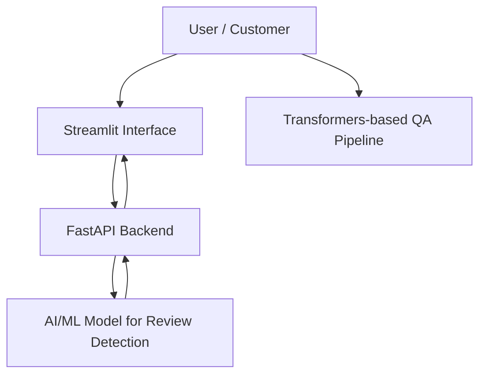
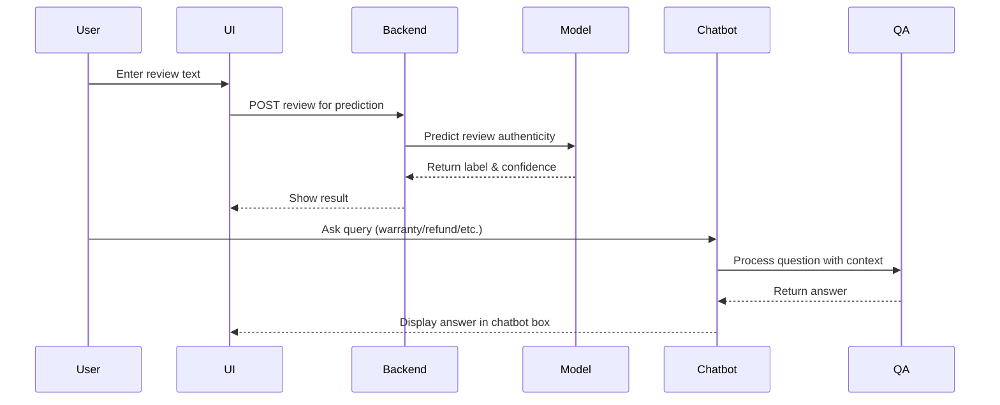

# 🛒 Fraudulent Review Detection System with Chatbot Assistance

> **B.Tech Community Project – 2025**  
> **Problem Statement:** *Detect fake/incentivized product reviews and provide AI-based assistance for e-commerce queries.*

---

## 🌟 Project Overview

This repository contains a **Fraudulent Review Detection System** integrated with a **Chatbot Assistance** feature. The system is designed to:

- Analyze product reviews for authenticity using **AI/ML models**.
- Detect **fake or incentivized reviews**.
- Provide users guidance on **product issues, refunds, warranties, and replacements** through an AI-powered chatbot.
- Offer a **user-friendly Streamlit UI** with an interactive review analyzer and a floating chatbot.

The system uses a **custom backend** (FastAPI) for review prediction and **transformer-based QA models** for chatbot responses.

---

## 🎯 Features

### ✅ Review Detection System
- Detects **genuine vs fraudulent reviews**.
- Shows **confidence scores** for predictions.
- Maintains a **recent reviews history** for reference.

### ✅ Chatbot Assistance
- Interactive chatbot floating on the **bottom-right corner**.
- Answers queries related to **product defects, warranties, refunds, and review authenticity**.
- Uses **transformers-based QA pipeline** for accurate responses.

### ✅ User Interface
- Modern **Streamlit UI** with **gradient cards** and **highlighted buttons**.
- **Floating chatbot icon** opens a **square chatbot interface** for queries.
- **Responsive design** for easy navigation.

---

## 🧩 Architecture




🗂️ Project Structure
A clear folder & file structure of the framework:

```graphql
fraudulent-review-detection/
├── backend/                   # FastAPI backend
│   ├── main.py                # API endpoints for review prediction
│   └── models.py              # ML model loading & prediction
├── chatbot/                   # Chatbot QA logic
│   └── rag_chatbot.py         # Transformers QA pipeline
├── frontend/                  # Streamlit UI
│   └── app.py                 # Main UI script
├── data/                      # Sample reviews & dataset (optional)
├── requirements.txt           # Python dependencies
└── README.md                  # Project documentation
```

